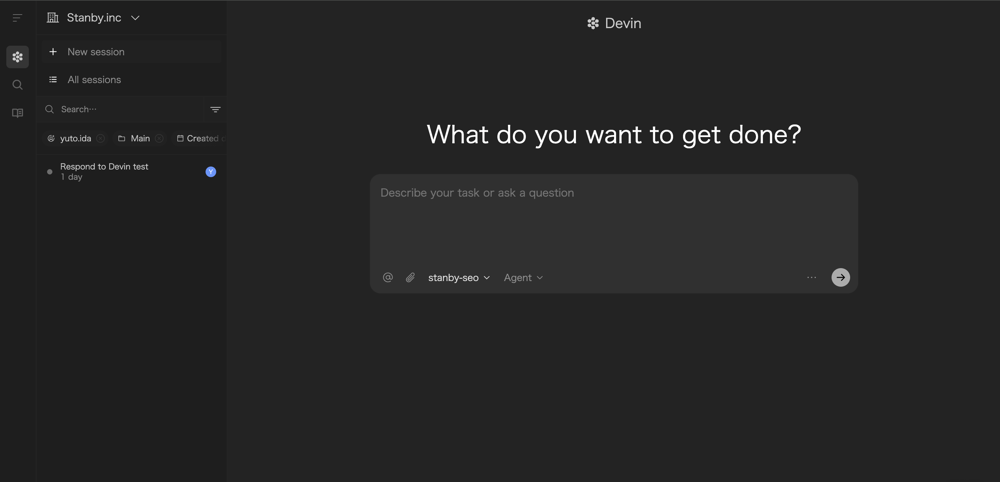

<!-- _class: lead -->

# Devin活用術

### 20250920

---

# 今日の内容

-  Devinの概要や機能の紹介 
-  使う上でのポイント

---

<!-- _class: lead -->

## **Devinとは?**

---

# Devinの特徴

-  自律性の高いAIコーディングエージェント
-  仮想環境、エディタ、ブラウザを内蔵しており、Devinが自由に操作可能
-  人間が並走して指示を出す必要が少なく、並列実行可能
-  ジュニアレベルのエンジニア相当の能力

---

<!-- _class: lead -->

## **まとめると、**

---

<!-- _class: lead -->

## 指示を出したら、PRを出すまで自動で動いてくれるジュニアエンジニア👶

---

<!-- _class: lead -->

## **基本的な使い方**

---

# 基本的な使い方：Slackアプリからの指示

@Devinをつけて指示を出す

---

# 基本的な使い方：Webアプリから指示を出す

+ New sessionで新しいセッション

---

# Devinのワークフロー

1. 指示を出す
2. 計画を立てる
3. テストを実行する
4. PRを作成する

---

<!-- _class: lead -->

## **Devinを強くする1🦾**
## **rules編**

---

# Knowledge

-  Devinにプロジェクト特有のルールを学習させる
-  Devinと会話していると💡が出てきて、クリックするとKnowledgeとして保存できる
-  適用範囲は、リポジトリなし、特定のリポジトリ、すべてのリポジトリから選択可能

---

# AGENTS.md

-  CLAUDE.mdやinstructions.mdに相当
-  Gitで管理できる

---

# Playbook

-  カスタムコマンドとして登録できる
-  PRレビューなどの定型作業を自動化できる

---

# Knowledge vs Playbook

- Playbook で定型作業を自動化し、開発の初速を上げる。
- Knowledge でプロジェクト特有のルールをDevinに学習させ、アウトプットの品質を向上させる。

---

<!-- _class: lead -->

## **Devinを強くする🦾**
## **Linuxサーバーのセットアップ編**

---

# Linuxサーバーのセットアップ

-  Devinはリポジトリ毎に仮想環境をもつ
-  仮想環境をセットアップすることで、Devinの能力を引き出せる
-  ブラウザからのE2Eテストなどが可能になる

---

<!-- _class: lead -->

## **Devinを強くする2🦾**
## **MCPサーバー編**

---

<!-- _class: lead -->

## **最近MCP Marketplaceができました🎉**

---

---

<!-- _class: lead -->

## **ただし、**

---

<!-- _class: lead -->

## **Playwright MCP ≒ Devinのブラウザ操作**

---

<!-- _class: lead -->

## **Serena MCP ≒ DevinのVSCode**

---

<!-- _class: lead -->

## **なので、足りないものだけ自分で見つけて入れましょう**

---

<!-- _class: lead -->

## **指示を出す上でのポイント**

---

<!-- _class: lead -->

## **1. Devinはジュニアエンジニア👶ということを意識する**

---

<!-- _class: lead -->

- できるだけ具体的かつ、明確に指示をする
- 作業はWhy→How→Whatの順番で伝える
- 必ず予定を立ててから作業を行う(これは自動でやってくれる)
- 一度に大きなタスクを与えすぎない
- 膨大な情報を与えすぎない
- 知識のない作業を無理にやらせない

---

<!-- _class: lead -->

## **注意点**

---

<!-- _class: lead -->

- セッションのACUが5ACUを超えると、性能低下が起きる->通知をONにし、セッションが長くなっている場合は、早めに切る
- リンターのエラーで無限ループに陥り、ACUを消費し続けることがある -> Knowledgeで回避
- 何も指定しないとmainブランチで作業する -> mainへのpushのガードや、作業ブランチを指定する
- 何も指定しないとPRを必ず作成してくる -> PRが不要な場合は、明示的に指示しましょう

---

<!-- _class: lead -->

## **その他機能**

---

# 機能紹介1：Ask Devin

- コードベースを理解しているDevinに質問することができる
- コードの説明、バグの特定、改善点の提案など
- Slackアプリから使用するには @Devin !ask <質問内容> とする
- **無料で利用可能!!**

---

# 機能紹介2：DeepWiki

- ソースコードを解析してドキュメントを自動生成
- **無料で利用可能!!**

---

<!-- _class: lead -->

## **チーム活用事例**

---

# Devin Slack Code Actions

-  PRからDevinを呼び出してコードレビューを依頼

---

# 裏技的なTips

-  Ask Devin（無料）で質問して、計画を立てる部分までやってもらい、ACUを節約
-  Devinがタスクを完遂できなかった場合は、その旨をDevinに伝えるとACUを一部返却してもらえる

---

<!-- _class: lead -->

## **fin**

